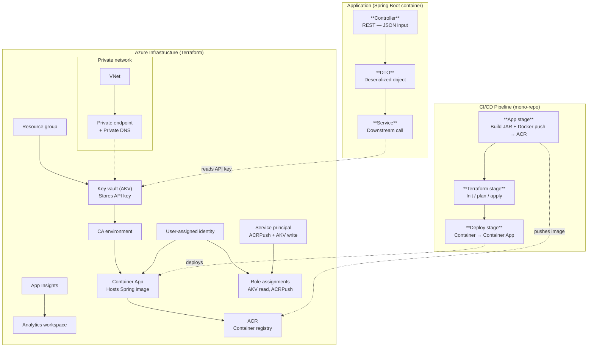

# Pollinate Technical Test - Ruaan Klem

This readme is my attempt to not only rationalize how I approached this technical assessment but also to create a 
"how-to" guide to run this "locally"

### Local setup and deploy
Since the specifications for this assessment were very clear regarding the CI/CD pipeline structure fully automating 
this solution isn't entirely possible since "secret zero" is a real thing.

With that in mind there is some bootstrapping required prior to actually running the pipeline. Unfortunately because 
of the restrictive CI/CD structure this bootstrapping has to be done using click-ops. In a real world production environment I would not do it this way, I just wanted to mention that so you don't think that this is the kind of work I usually deliver.

1. Create a resource group named `rg-pollinate-platform-dev` or `rg-pollinate-platform-prd`
2. Create a Key Vault in this RG called `pollinate-tf-secrets`
3. Create a Service Principle (SP) in your Azure subscription named `pollinate-sp`.
4. Create 4 secrets in `pollinate-tf-secrets`: 
   1. `client-secret`: `pollinate-sp-client-secret-in-clipboard`
   2. `sp-client-id`: `pollinate-sp-client-id`
   3. `subscription-id`: `azure-subscription-id`
   4. `tenant-id`: `azure-tenant-id`
5. Create a storage account named `sapollinate`
6. Create a container in the SA called `pollinate-state`
7. Assign the Contributor role to `pollinate-sp` to the Azure subscription (ideally there would be multiple SP's for the different goals, but to reduce complexity I opted to give my SP enough rights to do it all)
8. Create a project in Azure DevOps
9. Create a Service Connection in Azure DevOps for the pipeline
10. Assign the `Storage Blob Data Contributor` role on `sapollinate` to the newly create service account
11. Assign the `Key Vault Secrets User` role on `pollinate-tf-secret` to the newly create service account
12. Create a variable group in Azure DevOps called `General` with 4 values:
    1. `ARM_CLIENT_ID`: `pollinate-sp-client-id`
    2. `ARM_CLIENT_SECRET`: `pollinate-sp-client-secret-in-clipboard`
    3. `ARM_SUBSCRIPTION_ID`: `azure-subscription-id`
    4. `ARM_TENANT_ID`: `azure-tenant-id`
13. Create 2 environments named `dev` and `prd` and add approvals to the `prd` environment

Once all this is done then the Azure pipeline can be run, this will:
1. Build the Spring application
2. Build the Docker container (cannot push to ACR yet since it doesn't exist yet)
3. Run Terraform scripting to create all the appropriate infrastructure (including the ACR)
4. Deploy the application to Azure Container App (first run will fail since the ACR wasn't available to push the container to)

Once the pipeline has run at least once, uncomment the ACR push task in the first stage and rerun the pipeline. 
This will push the image to ACR and then the Deploy stage should be able to deploy to ACA with the newly pushed container

### Tradeoffs
As discussed earlier in this README, I had to bootstrap some Azure resources to adhere to the proposed requirement 
specifically the ordering of the CI/CD pipeline

I also opted for wider permissions for the Service Principle and Service Connection purely for the sake of complexity. 
Given the time constraint of this technical assessment I felt that giving the SP and SC wider permissions is acceptable
for PoC purposes. If this were to be productionized I'd review the assigned roles to strip it down to only what is strictly speaking required.

I also opted to not use https connections in the application since I'd have to issue a TLS certificate and have 
it signed by an appropriate CA which in real world environments aren't done from a local laptop but rather through 
an authorized process internally, ideally using something like ACME to auto-rotate these certificates.

### Architecture
The architecture I opted for was mostly guided by the requirements document.

I opted for a mono-repo that houses everything in a single repo. While this does offer a lot of benefits it isn't an ideal
setup for app code, infrastructure and pipelines to live all in one repo. Ideally these are separated in their own repo's.
This would make it possible to create more generic pipelines that can be implemented as "simple" components in the application
and infrastructure repo's. This obviously obfuscates all the pipeline complexity from the teams that aren't concerned with
pipeline "magic" while simultaneously providing the flexibility to alter the pipelines to adhere to ever emerging security 
and automation requirements.

The code architecture I feel is fairly simple to follow. There's a controller that serves the api that accepts a JSON input
which is deserialized into a Java object (Data Transfer Object or DTO). This DTO is then used to call a downstream service 
in the service class. The response from the downstream call is hardcoded since the API doesn't actually exist, or at least
not in the form it was provided. The API key is pulled from AKV and provided as an environment variable to the container
where Spring picks it up and uses it in the API call. There is a generic and specific error handler to deal with downstream
API outages as well anything internally going wrong. I also leveraged the OpenTelemetry dependency to facilitate CorrelationID
tracking of requests. All of this logged out with an appropriate formatting to make any debugging or error checking easier

The Terraform architecture should also be pretty self-explanatory. In a true production setup I would create modules, but 
since the technical assessment required all the Terraform to be in a single directory it mixes traditional infrastructure setup
with application specific set up. Creating modules wouldn't reduce the complexity or improve the readability since ultimately
each resource would just be a module. There are "static" resources created that would only be created once off (ACR, CA, CAE, etc.)
and as such I opted to just use the resources as is. The naming convention I opted for was to try and keep all the resource
names as concise as possible. There is also an inherent constraint with AKV where the name cannot exceed 24 characters
and as such I attempted to keep all resource names under that limit to create uniformity. 

Terraform creates a resource group first, followed by the key vault, analytics workspace, container app environment, user 
assigned identity. Once the identity is created roles are assigned to it so it can read secrets from AKV, to pull the API key.
Once that is done the container application is created along with a template for the application. The service principle
created originally is given the appropriate roles to push a secret to AKV using the Private Endpoint. Application insights
are pushed to the app insights resource. A vnet is obviously also required to facilitate the PE along with a private dns
and a virtual network link. Finally, a list of ACR's is pulled so that the SP can get the ACRPush role assigned to it. This
is done for all ACR's since there might be an ACR for each environment, although that might be excessive.

Lastly the Pipeline automates this entire process flow. It starts with building the Spring jar, and passes the jar over
to the Dockerbuild job where the container is built and pushed to ACR. The Terraform stage runs the init, plan and apply 
outlined in the paragraphs above. Finally, it deploys the container created in the App stage to the CA created in Terraform
stage. 

### Architecture Diagram

### Closing
This was a very nice technical assessment. I really enjoyed building this, it's been a while since I've worked with Java
so this was a nice throw-back to my early career.

If you have any difficulties deploying this application in your environment please don't hesitate to reach out (ruaanmk@gmail.com).
I have tested and run this in my personal Azure subscription, and it does work, even if it requires a little back and forth.