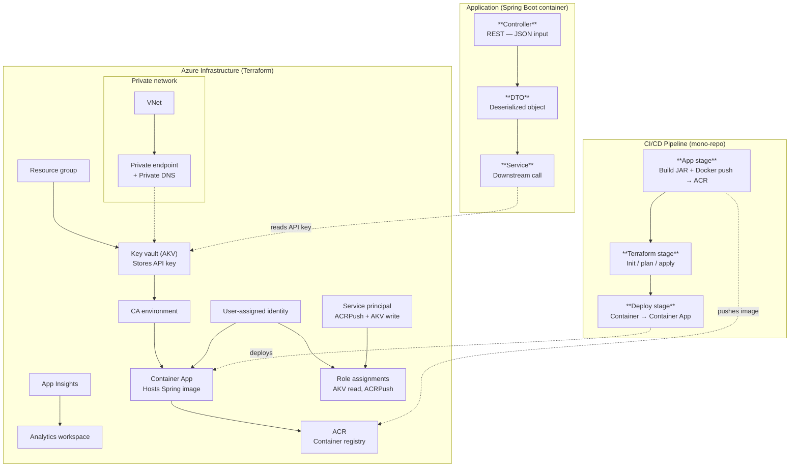

## Architecture

```mermaid
flowchart TD
    subgraph pipeline["CI/CD Pipeline (mono-repo)"]
        A["**App stage**\nBuild JAR + Docker push → ACR"]
        B["**Terraform stage**\nInit / plan / apply"]
        C["**Deploy stage**\nContainer → Container App"]
        A --> B --> C
    end

    subgraph app["Application (Spring Boot container)"]
        D["**Controller**\nREST — JSON input"]
        E["**DTO**\nDeserialized object"]
        F["**Service**\nDownstream call"]
        D --> E --> F
    end

    subgraph infra["Azure Infrastructure (Terraform)"]
        G["Resource group"]
        H["Key vault (AKV)\nStores API key"]
        I["Analytics workspace"]
        J["CA environment"]
        K["Container App\nHosts Spring image"]
        L["ACR\nContainer registry"]
        M["User-assigned identity"]
        N["App Insights"]
        subgraph pvt["Private network"]
            O["VNet"]
            P["Private endpoint\n+ Private DNS"]
            O --> P
        end
        Q["Service principal\nACRPush + AKV write"]
        R["Role assignments\nAKV read, ACRPush"]

        G --> H
        H --> J
        J --> K
        K --> L
        M --> K
        M --> R
        Q --> R
        P -.-> H
        N --> I
    end

    A -.->|"pushes image"| L
    C -.->|"deploys"| K
    F -.->|"reads API key"| H
```
